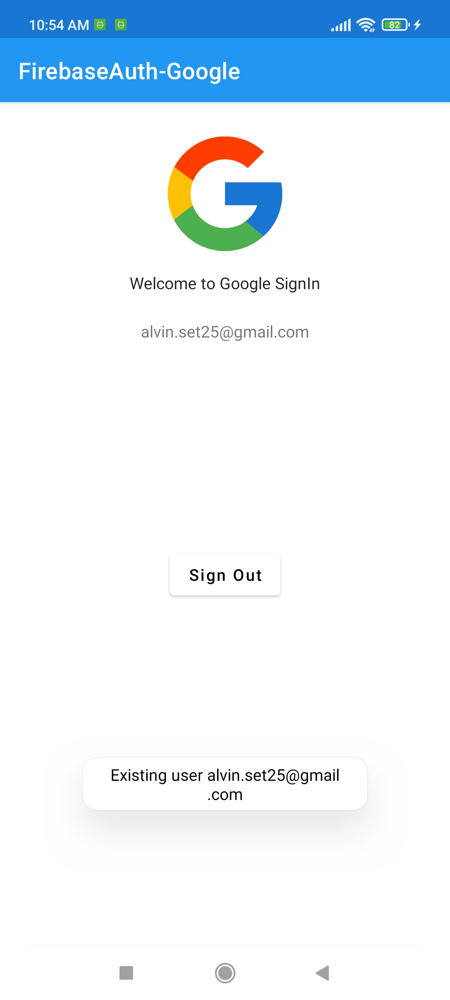
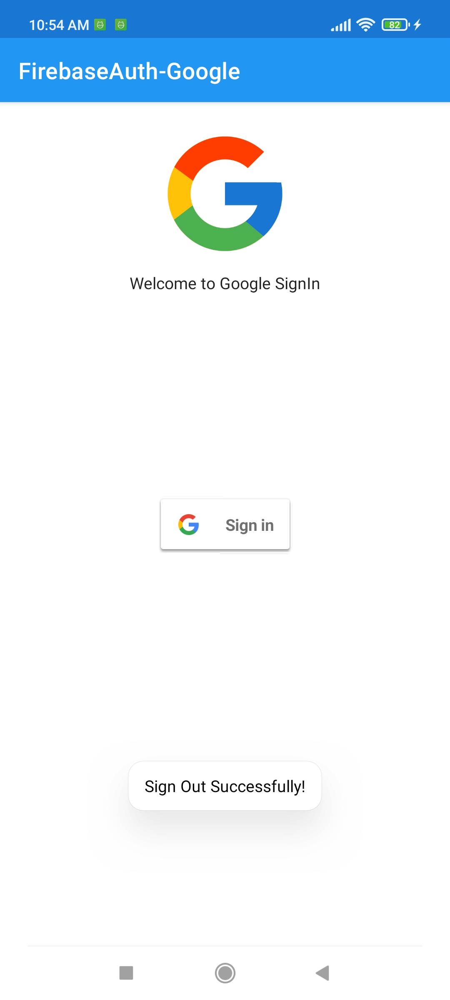

#  Firebase Authentication with Google Account

Authentication Android application using <a href="https://firebase.google.com/">`Firebase`</a> with the login system using **Google Account**

### **App Features Firebase Authentication with Google Account** :

-   **_Firebase_**
    -   Authentication with **`Google Account`**

## Important!

### Add Firebase to your Android project go to <a href="https://firebase.google.com/docs/android/setup">`Firebase Setup`</a>

<br>

## Design UI App Firebase Authentication with Google Account

### **`Preview Firebase Auth with Google Account`**


### **`Preview UI FirebaseAuth-Google`**

|        Name Page        |                         Preview UI                         |
| :---------------------: | :--------------------------------------------------------: |
|         `Home`          |  |
|   `Choose an Account`   |  |
|    `Account created`    |  |
| `Account already exist` |  |
|       `Sign out`        |  |

<br>

## Result on Firebase Console

### **`Authentication`**


<br>

## Dependencies used

```groovy
    /** Firebase*/
    implementation platform('com.google.firebase:firebase-bom:29.0.1')
    implementation 'com.google.firebase:firebase-analytics-ktx'
    implementation 'com.google.firebase:firebase-auth-ktx'
    implementation 'com.google.android.gms:play-services-auth:20.0.0'

```

### Integration Step Used Binding in Kotlin

1. Add **viewBinding `true`** <a href="./app/build.gradle">`build.gralde (Module)`</a>

```groovy
android {
   ...
   buildFeatures {
      viewBinding true
   }
}
```

2. Activity Kotlin Class

```kotlin
class MainActivity : AppCompatActivity() {

    /** Add this */
    private lateinit var binding: ActivityMainBinding

    override fun onCreate(savedInstanceState: Bundle?) {
        super.onCreate(savedInstanceState)
        /** Add this */
        binding = ActivityMainBinding.inflate(layoutInflater)

        /** Change this */
        setContentView(binding.root)

        /** Without findViewById */
        binding.textView.text = "Bye bye findViewById"
    }
}
```

3. Activity Java Class

```java
public class MainActivity extends AppCompatActivity {

    /** Add this */
    private ActivityMainBinding binding;

    @Override
    protected void onCreate(Bundle savedInstanceState) {
        super.onCreate(savedInstanceState);
        /** Add this */
        binding = ActivityMainBinding.inflate(getLayoutInflater());

        /** Change this */
        setContentView(binding.getRoot());

        /** Without findViewById */
        binding.textView.setText("Bye bye findViewById");
    }
}
```

**binding** in kotlin can be used directly without initializing **findViewById** on widgets in layout xml